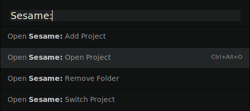
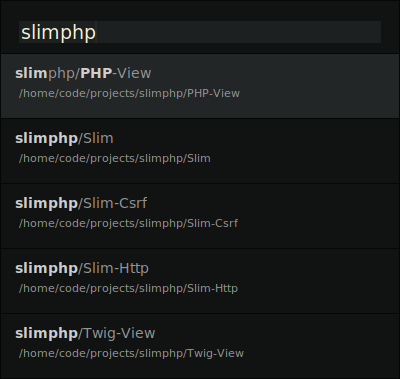

# WHAT OPEN SESAME IS

Add, open, remove, switch, and manage projects and folders, using the command palette and key bindings.

[](https://sublimetext.com) [](https://github.com/gerardroche/sublime-open-sesame/tags) [](https://github.com/gerardroche/sublime-open-sesame/stargazers) [](https://packagecontrol.io/packages/open-sesame) [](https://twitter.com/gerardroche)


Set the location of your projects:

`Preferences > Settings`

```json
{
    "open-sesame.path": "~/projects"
}
```



Adding, opening, or switching a project will prompt an overlay for you to select a project.

By default your projects are listed in the format `your/project`.



If you prefer to organise your projects at a single level then set the depth to `1`:

`Preferences > Settings`

```json
{
    "open-sesame.depth": 1
}
```

## INSTALLATION

### Package Control installation

The preferred method of installation is [Package Control](https://packagecontrol.io/browse/authors/gerardroche).

### Manual installation

1. Close Sublime Text.
2. Download or clone this repository to a directory named `open-sesame` in the Sublime Text Packages directory:
    * Linux: `git clone https://github.com/gerardroche/sublime-open-sesame.git ~/.config/sublime-text-3/Packages/open-sesame`
    * OS X: `git clone https://github.com/gerardroche/sublime-open-sesame.git ~/Library/Application\ Support/Sublime\ Text\ 3/Packages/open-sesame`
    * Windows: `git clone https://github.com/gerardroche/sublime-open-sesame.git %APPDATA%\Sublime/ Text/ 3/Packages/open-sesame`
3. Done!

## Commands

Command Palette | Command | Description
--------------- | ------- | -----------
Open Sesame: Add Project | `open_sesame_add_project` | Add a project to the current window
Open Sesame: Open Project | `open_sesame_open_project` | Open a project in a new window
Open Sesame: Remove Folder | `open_sesame_remove_folder` | Remove a folder from the current window
Open Sesame: Switch Project | `open_sesame_switch_project` | Add a project to the current window

## Key bindings

Windows / Linux | OSX | Description
--------------- | --- | -----------
`Ctrl+Alt+O` | `Super+Alt+O` | Open Sesame: Open Project

Add your preferred key bindings:

`Menu > Preferences > Key Bindings`

```json
[
    { "keys": ["ctrl+alt+a"], "command": "open_sesame_add_project" },
    { "keys": ["ctrl+alt+o"], "command": "open_sesame_open_project" },
    { "keys": ["ctrl+alt+r"], "command": "open_sesame_remove_folder" },
    { "keys": ["ctrl+alt+s"], "command": "open_sesame_switch_project" },
]
```

On Ubuntu you may have conflict issues with key bindings such as `ctrl+alt+s` that may be mapped to something like the system `toggle-shaded` window command. You can clear the system keybinding with a command at terminal. If you have issues with key bindings on Ubuntu, ping me on twitter and I'll do my best to help you resolve it.

    $ gsettings set org.gnome.desktop.wm.keybindings toggle-shaded "[]"

## Configuration

Key | Description | Type | Default
----|-------------|------|--------
`open-sesame.depth` | Number of levels deep to look for projects within projects path. | `1` or `2` | `2`
`open-sesame.keymaps` | Enable the default keymaps. | `boolean` | `true`
`open-sesame.path` | Location of your projects. | `string` | The path found in the environment variable `PROJECTS_PATH` (if it exists).

### Path

`Preferences > Settings`

```json
{
    "open-sesame.path": "~/projects"
}
```

`Project > Edit Project`

```json
{
    "settings": {
        "open-sesame.path": "~/projects"
    }
}
```

#### Depth

The default depth is `2` which means that projects are listed using the pattern `*/*` e.g. `your/project`.

If you prefer to organise your projects at a single level, set the depth to `1`.

`Preferences > Settings`

```json
{
    "open-sesame.depth": 1
}
```

`Project > Edit Project`

```json
{
    "settings": {
        "open-sesame.depth": 1
    }
}
```

#### Multiple paths

Multiple paths can be set using a `PATH` separator (':' for POSIX or ';' for Windows) e.g. `"~/projects:~/work:~/src"`.

#### PROJECTS_PATH environment variable

A `PROJECTS_PATH` environment variable can be used to set the default path e.g. on Linux edit `~/.profile` (requires system restart) with `export PROJECTS_PATH=~/projects`.

#### Custom Commands

Example of creating some custom commands for `~/vendor` path.

`Menu > Preferences > Browse Packages`

Edit `User/Default.sublime-commands` (create the file if it doesn't already exist):

```json
[
    {
        "caption": "Open Sesame: Open Vendor",
        "command": "open_sesame_open_project",
        "args": { "path": "~/vendor" }
    },
    {
        "caption": "Open Sesame: Add Vendor",
        "command": "open_sesame_add_project",
        "args": { "path": "~/vendor" }
    },
    {
        "caption": "Open Sesame: Switch Vendor",
        "command": "open_sesame_switch_project",
        "args": { "path": "~/vendor" }
    }
]
```

Add preferred key bindings:

`Menu > Preferences > Key Bindings`

```json
[
    {
        "keys": ["ctrl+alt+v"],
        "command": "open_sesame_open_project",
        "args": { "path": "~/vendor" }
    }
]
```

## CONTRIBUTING

Your issue reports and pull requests are always welcome.

## CHANGELOG

See [CHANGELOG.md](CHANGELOG.md).

## LICENSE

Released under the [BSD 3-Clause License](LICENSE).
