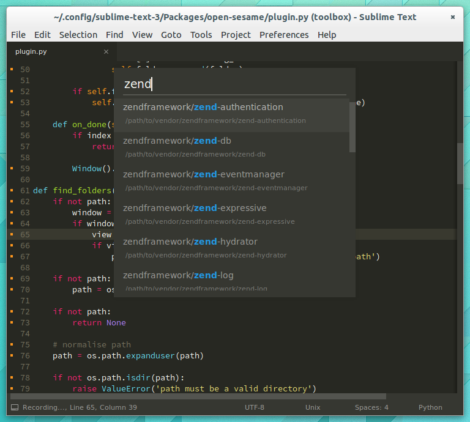

# WHAT OPEN SESAME IS

[](https://twitter.com/gerardroche) [](https://github.com/gerardroche/sublime-open-sesame) [](LICENSE) [](https://github.com/gerardroche/sublime-open-sesame/stargazers) [](https://sublimetext.com) [](https://github.com/gerardroche/sublime-open-sesame/tags) [](https://packagecontrol.io/packages/open-sesame)

Add, open and launch folders and projects quickly in Sublime Text.



## OVERVIEW

* [Installation](#installation)
* [Commands](#commands)
* [Key Bindings](#key-bindings)
* [Usage](#usage)
* [Configuration](#configuration)
* [Contributing](#contributing)
* [Changelog](#changelog)
* [License](#license)

Assume the following projects structure.

```
. ~/projects
├── doctrine
│   └── dbal
├── symfony
│   └── console
└── zend
    ├── mvc
    └── escaper
```

And the following configuration.

`Preferences > Settings - User`

```json
{
    "open-sesame.projects_path": "~/projects"
}
```

The command "Open Sesame: Open Project" or the key binding <kbd>Ctrl+Alt+O</kbd> (<kbd>Super+Alt+O</kbd> on OSX) will prompt a quick panel list of projects to select from to open.

```
doctrine/dbal
symfony/console
zend/mvc
zend/escaper
```

See the [configuration](#configuration) section for a more detailed explaination of the possible configurations.

## COMMANDS

* `Open Sesame: Open Project`
* `Open Sesame: Add Project Folder`

## KEY BINDINGS

OS X | Windows / Linux | Description
-----|-----------------|------------
<kbd>Super</kbd>+<kbd>Alt</kbd>+<kbd>O</kbd> | <kbd>Ctrl</kbd>+<kbd>Alt</kbd>+<kbd>O</kbd> | Open Sesame

## CONFIGURATION

Key | Description | Type | Default
----|-------------|------|--------
`open-sesame.keymaps` | Disable the default keymaps. | `boolean` | `true`
`open-sesame.projects_path` | Directory to look for projects. | `string` | `null`

### Configuring the projects path(s)

`Preferences > Settings - User`

```json
{
    "open-sesame.projects_path": "~/projects"
}
```

Multiple projects paths can be configured by using a path separater (':' for POSIX or ';' for Windows).

```json
{
    "open-sesame.projects_path": "~/work:~/src"
}
```


An environment variable `PROJECTS_PATH` can also be used to specify the projects path(s).


For example on Linux (requires restart) add the environment to `~/.profile`.

```
echo "export PROJECTS_PATH=~/projects" >> ~/.profile
```

### User Settings

`Preferences > Settings - User`

```json
{
    "open-sesame.{Key}": "{Value}"
}
```

### Per-Project Settings

`Project > Edit Project`

```json
{
    "settings": {
        "open-sesame.{Key}": "{Value}"
    }
}
```

## INSTALLATION

### Package Control installation

The preferred method of installation is [Package Control](https://packagecontrol.io/browse/authors/gerardroche).

### Manual installation

1. Close Sublime Text.
2. Download or clone this repository to a directory named `open-sesame` in the Sublime Text Packages directory:
    * Linux: `git clone https://github.com/gerardroche/sublime-open-sesame.git ~/.config/sublime-text-3/Packages/open-sesame`
    * OS X: `git clone https://github.com/gerardroche/sublime-open-sesame.git ~/Library/Application\ Support/Sublime\ Text\ 3/Packages/open-sesame`
    * Windows: `git clone https://github.com/gerardroche/sublime-open-sesame.git %APPDATA%\Sublime/ Text/ 3/Packages/open-sesame`

## CONTRIBUTING

Your issue reports and pull requests are always welcome.

## CHANGELOG

See [CHANGELOG.md](CHANGELOG.md).

## LICENSE

Released under the [BSD 3-Clause License](LICENSE).
